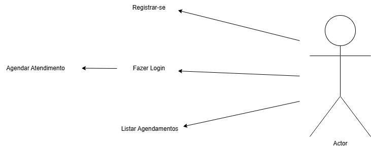

##PetShop

## 🐾 Sobre o Projeto
O **PetShop** é um backend desenvolvido em **Java 17 + Spring Boot**, feito para gerenciar autenticação de usuários e agendamentos de serviços para pets, como banho, tosa e entre outros.

O sistema inclui:
- Cadastro de usuários  
- Agendamento de serviços  
- Listagem de agendamentos do usuário autenticado
  
## 📘 Diagrama de Classes
.png)

## 🎭 Diagrama de Casos de Uso

---

## 📁 Estrutura do Projeto
